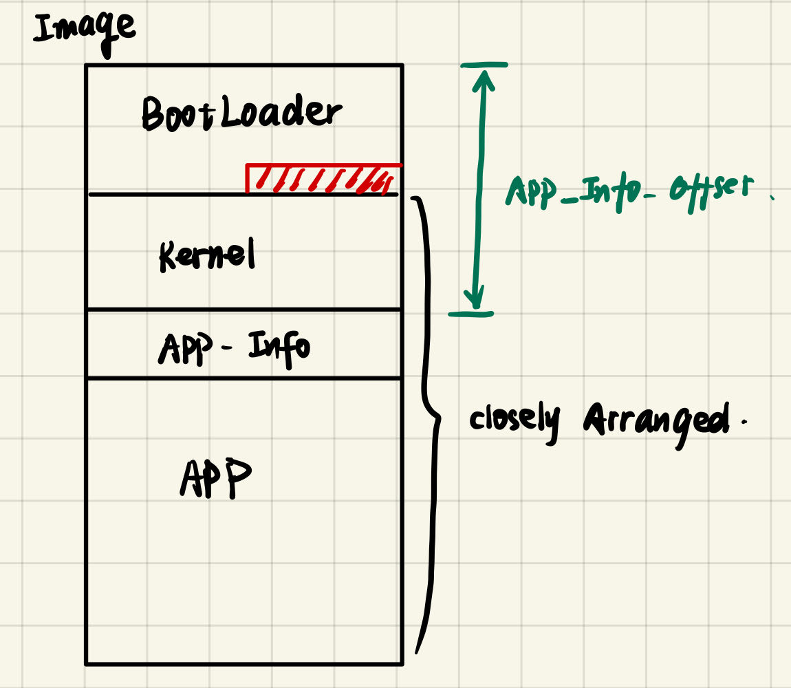
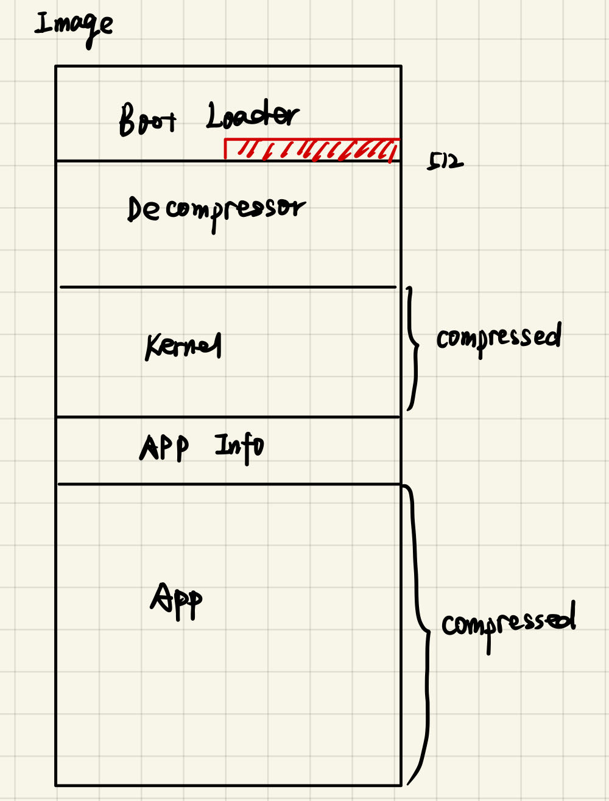
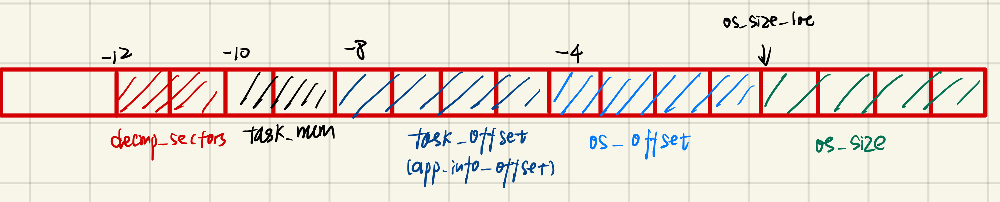
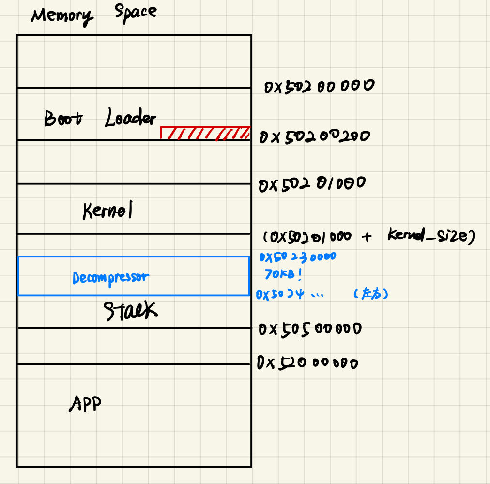

# Project1 BootLoader
## Overview
目录结构如下：
```
Project1-BootLoader
├── arch
│   └── riscv
│       ├── bios
│       │   └── common.c
│       ├── boot
│       │   └── bootblock.S
│       ├── crt0
│       │   └── crt0.S
│       ├── include
│       │   ├── asm
│       │   │   └── biosdef.h
│       │   ├── asm.h
│       │   ├── common.h
│       │   └── csr.h
│       └── kernel
│           └── head.S
├── createimage
├── decompressor
│   └── ker_decompressor.c
├── include
│   ├── os
│   │   ├── kernel.h
│   │   ├── loader.h
│   │   ├── sched.h
│   │   ├── string.h
│   │   └── task.h
│   └── type.h
├── init
│   └── main.c
├── kernel
│   └── loader
│       └── loader.c
├── libs
│   └── string.c
├── Makefile
├── README.md
├── riscv.lds
├── test
│   └── test_project1
│       ├── 2048.c
│       ├── auipc.c
│       ├── bss.c
│       └── data.c
├── tiny_libc
│   └── include
│       └── kernel.h
└── tools
    ├── createimage.c
    └── deflate
        ├── common_defs.h
        ├── example
        │   ├── Makefile
        │   └── test.c
        ├── lib
        │   ├── bt_matchfinder.h
        │   ├── decompress_template.h
        │   ├── deflate_compress.c
        │   ├── deflate_compress.h
        │   ├── deflate_constants.h
        │   ├── deflate_decompress.c
        │   ├── hc_matchfinder.h
        │   ├── ht_matchfinder.h
        │   ├── lib_common.h
        │   ├── matchfinder_common.h
        │   └── utils.c
        ├── libdeflate.h
        ├── stdbool.h
        ├── stddef.h
        ├── tinylibdeflate.c
        ├── tinylibdeflate.h
        └── type.h

23 directories, 48 files
```
## Task 1~3
本部分主要工作是实现镜像文件打包（createimage），通过bootloader将内核加载到内存并运行，最后在内核中实现用户程序的加载和运行。对应tag为`p1-task1`、`p1-task2`以及`p1-task3`。

涉及的改动如下：

**BootLoader**

`/arch/riscv/boot/bootblock.S`：调用bios_putstr输出字符串，随后调用bios_sd_read加载kernel到指定位置，最后跳转到指定地址进入内核。

**Kernel**

`/arch/kernel/head.S`：内核初始化块，用于清空bss段以及设置初始栈指针。

`/init/main.c`：内核，完成bss段检查以及跳转表初始化后，支持以输入taskid的方式启动用户程序。支持回显。

`/kernel/loader/loader.c`：加载用户程序。其通过bios将用户程序装载入内存后，将返回用户程序的入口地址。装载失败则返回0。

**User**

`/arch/riscv/ctr0/ctr0.S`：完成用户程序bss段清空，创建用户程序栈帧（保存返回地址），之后跳转到用户程序启动地址，结束后恢复栈帧。

**Createimage**

`/tools/createimage.c`：完成将bootloader、kernel以及用户程序ELF的打包。其中，bootloader填充到1个扇区，kernel以及用户程序各填充到15个扇区。最后在头一个扇区的倒数第4个字节（0x502001fc）的位置写上kernel所占的扇区数。

## Task 4
本部分主要工作时在镜像文件打包时实现紧密排列，并且在内核中支持通过文件名的方式启动用户程序。对应tag为`p1-task4`。

### 镜像文件结构
笔者设计的镜像文件结构如下：


在bootloader的填充段末位增加以下信息：

**tasknum**即用户程序的数量，**os_size**为kernel所占的扇区个数，**APPinfo offset**为存储用户程序信息的字块的偏移位置。

### 文件改动
涉及改动如下：
**BootLoader**

`/arch/riscv/boot/bootblock.S`：TODO指示在task4中此处需要加载与用户程序相关的参数到内存中。由于笔者将tasknum以及app_info_offset写在bootblock末尾的填充中，加载BIOS加载bootblock后其已在内存中；而对于更为详尽的APP-Info，笔者设计在main.c中通过bios_sd_read加载到对应位置，故***此处没有改动！！***
    
**Kernel**

`/include/os/task.h`：
    增加描述用户程序信息的结构体。
```cpp
typedef struct {
    char task_name[TASK_NAME_LEN];
    int offset;            // offset from bootblock (addr: 0)
    int size;
} task_info_t;    
```
其中`task_name`即用户程序名称，`offset`记录用户在镜像中用户程序起始位置，`size`即用户程序所占字节数。


`/init/main.c`：
1. 增加`init_task_info()`。其作用为在内核启动后（完成跳转表初始化），将镜像中的APP-Info装载到结构体数组`tasks[]`中。笔者采用的方法是先将APP-Info粗拷贝（扇区粒度）到0x52000000中暂存，再细拷贝（字节粒度）到结构体数组中。
2. 支持输入用户程序名，并将其交给loader函数加载。


`/kernel/loader/loader.c`：
支持通过用户程序名装载函数，并返回用户程序入口地址。装载失败（如用户程序不存在）时，返回值为0。装载用户程序时同样采用粗拷贝-细拷贝的方式。

**Createimage**
`/tools/createimage.c`：
在上文所示位置写入APP-Info（task_info结构体所需要的内容）以及在第一个扇区末尾写入规定的信息。除了bootblock外，其余程序不再进行填充。

### Hint
1. 笔者开始时设计在bootblock加载kernel时将APP-Info一起加载入内存，然而并不能成功。原因是APP-Info所在位置恰好为kernel的bss段，会被`head.S`清空。
2. 在粗粒度加载时（APP-Info以及用户程序），请务必注意起始扇区编号以及需要读取的扇区个数。

## Task 5
本部分主要工作是在打包镜像文件时将kernel以及用户程序压缩，并且编写内核的自解压程序。对应tag为`p1-task5`。

### 镜像文件结构
Task5中的镜像结构如下：

BootLoader的末尾填充中增加以下信息：

其中os_offset为kernel起始位置在镜像中的偏移，os_size为kernel大小，以字节为单位。

### 运行流程
BIOS加载bootloader到内存后，bootloader首先加载自解压程序decompressor并跳转运行，decompressor会将压缩的kernel从SD卡读出并解压到指定位置，运行结束后再次返回bootloader，接下来再跳转到kernel运行。

Kernel运行时，当遇到需要启动用户程序，同样是将压缩的应用程序从SD卡中解压到指定位置，再跳转执行程序。

### 内存摆放
目前暂时将自解压程序decompressor摆放在kernel后的内存地址0x50230000，若之后随着kernel所占字节数的增加，为避免自解压时的覆盖，也可能将该位置继续后移。

整体内存摆放如下：



### 文件改动
**BootLoader**

`/arch/riscv/bootblock.S`：
增加加载decompressor以及跳转执行。

**Kernel**

`/init/main.c`：
在初始化时，修改获得app_info_offset、task_num等参数的地址。

`/kernel/loader/loader.c`：
修改加载方式，实现从SD卡读取用户程序并解压到指定位置。

**Createimage**

`/tools/createimage.c`：
修改镜像打包方式，支持将程序压缩再写入镜像文件。

**Makefile**

`/Makefile`：
修改编译参数和编译目标，以支持`createimage.c`的压缩操作以及`decompressor.c`和`loader.c`中的解压操作。

### Hint
由于自解压时需要C环境，因此笔者在编译时将`decompressor.c`和`head.S`一同编译。