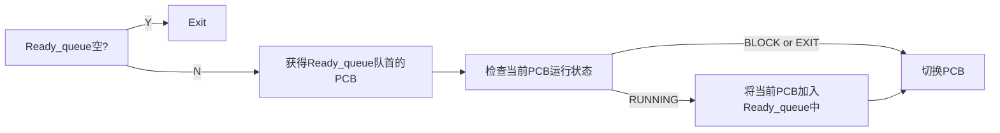

# Project2-SimpleKernel
## Part 1
本部分主要任务是实现进程的初始化和挂载运行，实现基于跳转表的系统调用，并且实现锁的基本操作。

### Task 1：任务启动与非抢占式调度
由于本部分尚不涉及中断操作，CPU上的调度需要通过程序自身调用yield系统调用以主动让出CPU资源。
#### 1. PCB
PCB结构如下：  
```C
typedef struct pcb
{
    /* register context */
    // NOTE: this order must be preserved, which is defined in regs.h!!
    reg_t kernel_sp;
    reg_t user_sp;

    /* previous, next pointer */
    list_node_t list;

    /* process id */
    pid_t pid;

    /* BLOCK | READY | RUNNING */
    task_status_t status;

    /* cursor position */
    int cursor_x;
    int cursor_y;

    /* time(seconds) to wake up sleeping PCB */
    uint64_t wakeup_time;

    /* name */
    char name[MAX_NAME_LEN];
} pcb_t;
```
与default相比增加了name一项，用于记录进程名称。此外，在PCB中嵌入了list链表项，笔者实现了以下操作：  
```C
// void list_insert(head_ptr, node_ptr): insert node into head
static inline void list_insert(list_node_t *list_head_ptr, list_node_t *list_node_ptr)

// delete *ptr node
static inline void list_delete(list_node_t *ptr)

// list_node_t *list_delete(head_ptr): pop node from head
static inline list_node_t *list_pop(list_node_t *list_head_ptr)
```
需要注意的是以上操作均是针对PCB中的链表项进行的，要对相应的PCB操作还需要根据list项在PCB中的位置进行恢复。  

#### 2. 初始化
一个进程所占用的内存区域如下：  
<center></center>  

因此，在初始化PCB时，需要在内核栈和用户栈上为其分配空间。  
此外，内核第一次将进程挂载到CPU上时，需要为其准备一个假现场，即伪造相应的寄存器值，使得switch_to函数可以正常运行。其中最需要注意的是ra寄存器，在Part-1中只需令其为对应task的entry_point即可。  

#### 3. switch_to
该函数功能是完成**内核态**上的上下文的切换。其过程为：  
`在当前进程的内核栈上保存相应寄存器` - `切换到下一进程的内核栈` - `恢复相应寄存器值` - `跳转到ra地址恢复运行`  
需要注意的是线程寄存器tp也需要改变。  

#### 4. 调度
调度流程如下：


#### 5. 其他
在Part-1中，事实上所有的用户进程都是运行在内核栈上的，在Part-2加入中断后将进一步实现内核-用户的分离。

### Task 2：互斥锁的实现
本部分主要任务是调用相应的原子操作API实现互斥锁的初始化、请求和释放。

#### 1. 锁结构
锁的结构如下：
```C
typedef struct mutex_lock
{
    spin_lock_t lock;
    list_head block_queue;
    int key;
} mutex_lock_t;
```
其中，lock项为锁本身，其有两种状态：lock和unlock；block_queue为请求该锁的进程的队列；key为该锁对应的句柄。  

#### 2. 锁相关操作（lock.c）
```C
int do_mutex_lock_init(int key);
void do_mutex_lock_acquire(int mlock_idx);
void do_mutex_lock_release(int mlock_idx);
```
`do_mutex_lock_init`：创建一个句柄为key的锁，返回该锁的id。  
`do_mutex_lock_acquire`：尝试获取句柄为mlock_idx的锁，若失败则将当前进程挂起到对应锁的block_queue中。  
`do_mutex_lock_release`：释放句柄为mlock_idx的锁，之后会从锁的block_queue中获得一个进程并将其加入ready_queue中；若block_queue中已无进程，则将锁的状态置为unlock。  

## Part 2  
本部分的主要内容为：  
1）支持使用中断/例外的方式（syscall）完成系统调用，而不是使用跳转表  
2）支持时钟中断，实现抢占式调度  
3）支持进程的睡眠和唤醒操作  
4）支持线程的创建和调度  

### Task 3
本任务主要目标是完成例外初始化、上下文的恢复与保存、例外结束返回、支持系统调用和进程的睡眠操作。  

`例外初始化`：  
init_exception()。其主要工作是初始化中断表和例外表，并且调用setup_exception()完成STVEC初始化和SSTATUS中SIE使能。  

`上下文的恢复与保存`：  
即SAVE_CONTEXT和RESTORE_CONTEXT。需要注意的是，此处上下文的恢复与保存是在内核栈上的，因此首先需要切换到当前进程的内核栈：  
```
.macro SAVE_CONTEXT
  sd    sp, PCB_USER_SP(tp)
  ld    sp, PCB_KERNEL_SP(tp)       # switch to kernel stack
  addi  sp, sp, -(OFFSET_SIZE)
```  
之后需要使用CSR指令将CSR寄存器的值读出到通用寄存器，再保存到栈的对应位置。此外，因为读写CSR寄存器需要通用寄存器周转，因此在恢复上下文的时候应当首先恢复CSR寄存器值，再恢复通用寄存器的值。最后恢复时不要忘记将sp从内核栈切换到用户栈 :)  

`例外的触发与处理`：  
在初始化例外时，STVEC的值被写为exception_handler_entry，这意味着当例外触发时（本实验中为ecall或时钟中断），硬件会自动跳转到该地址上。之后，需要将ra设置成ret_from_exception以实现从中断返回的操作，然后将指向上下文内容（亦即xv6中的trapframe）的指针、STVAL和SCAUSE的值按RISCV的ABI约定写到a0~a2完成传参，最后跳转到C函数interrupt_helper（irq.c）中进行处理。  
在interrupt_helper中，首先根据SCAUSE的首位情况判断例外类型，再根据剩余值在中断/例外表中找到对应的处理函数执行。  
对应的syscall处理函数为handle_syscall。其工作是根据传入的上下文内容判断系统调用类型，再进行相应的传参和系统调用。需要注意的是，在处理结束后需要将返回值保存到上下文内容中a0的位置，并将上下文中的sepc加4。  

`例外结束返回`：  
ret_from_exception()。其工作十分简单，只需要恢复上下文，然后执行sret即可。

`系统调用`：
总的来说，系统调用有以下过程：
```
syscall(内联汇编传参、ecall) -> exception_handler_entry -> interrupt_helper -> (对应处理函数) -> ret_from_exception -> ...
```  
其中，除了首尾两个部分处在用户态，其余部分均为内核态。  

`进程的睡眠操作`：  
do_sleep()。其功能是将当前进程暂停然后挂起到睡眠队列：  
```C
void do_sleep(uint32_t sleep_time)
{
    current_running->wakeup_time = get_timer() + sleep_time;
    current_running->status = TASK_BLOCKED;
    list_insert(&sleep_queue, &(current_running->list));
    do_scheduler();
}
```  
笔者选择在调度时（do_scheduler）首先检查睡眠队列，将所有应当唤醒的进程重新添加到准备队列：  
```C
void do_scheduler(void)
{
    // TODO: [p2-task3] Check sleep queue to wake up PCBs
    check_sleeping();
    ...
}
```

`其他`：  
其他需要注意的内容为PCB的初始化需要改变。首先明确一点，**switch_to完成的是内核栈上的切换**；而在Part 1中，我们只使用了switch_to，所有的用户工作实际上都是在内核栈上完成的，因此我们伪造第一次switch_to的上下文时将ra设置成对应进程的entry_point。  
而在系统调用过程的简述中我们可以看到，**例外/中断的到来导致用户态向内核态的切换**，**ret_from_exception则完成内核态向用户态的切换**。在Part 2中内核和用户需要得到更好的区分，因此我们将switch_to_context的ra设置成ret_from_exception，而将reg_context的sepc设置成entry_point。  
```C
static void init_pcb_stack(
    ptr_t kernel_stack, ptr_t user_stack, ptr_t entry_point,
    pcb_t *pcb)
{
    regs_context_t *pt_regs =
        (regs_context_t *)(kernel_stack - sizeof(regs_context_t));
    for (int i = 0; i < 32; i++)
        pt_regs->regs[i] = 0;
    pt_regs->regs[2] = (reg_t)user_stack;       // sp
    pt_regs->regs[4] = (reg_t)pcb;              // tp
    pt_regs->sepc = (reg_t)entry_point;
    pt_regs->sstatus = SR_SPIE & ~SR_SPP;

    switchto_context_t *pt_switchto =
        (switchto_context_t *)((ptr_t)pt_regs - sizeof(switchto_context_t));
    for (int i = 0; i < 14; i++)
        pt_switchto->regs[i] = 0;
    pcb->kernel_sp = (reg_t)pt_switchto;
    pt_switchto->regs[1] = (reg_t)pt_switchto;          // sp
    pt_switchto->regs[0] = (reg_t)ret_from_exception;   // ra
}
```

### Task 4
本任务主要目标是支持时钟中断和抢占式调度。  
`时钟中断初始化`：  
1）在setup_exception中，打开全局中断（SIE）  
2）在main.c中，调用bios_set_timer设置第一次时钟中断  

`时钟中断处理`：  
只需要设置下一次时钟中断并重新调度即可：  
```C
void handle_irq_timer(regs_context_t *regs, uint64_t stval, uint64_t scause)
{
    bios_set_timer(get_ticks() + TIMER_INTERVAL);
    do_scheduler();
}
```

`第一次调度`：  
笔者通过触发一次时钟中断以实现第一次的调度。需要注意的是，在第一次调度时current_running指向pcb0，但是tp寄存器并没有被赋值，而处理例外时需要在tp指向的内核栈上保存上下文，导致访问禁戒的地址区域。因此笔者在初始化时通过内联汇编为tp寄存器赋值，使得第一次保存上下文发生在pcb0的内核栈区域：  
```C
static void init_pcb(void)
{
    ...
    /* TODO: [p2-task1] remember to initialize 'current_running' */
    current_running = &pid0_pcb;
    asm volatile ("mv tp, %0\n\t"
                :
                :"r"(current_running)
                :"tp"
                );
}
```

### Task 5
本任务主要目标是支持线程的创建和调度，同时需要自行编写用户程序完成相关线程功能的测试。  
`PCB`：  
在本任务中需要对pcb结构进行修改：  
```C
typedef struct pcb
{
    ...
    /* Thread id */         // <- mark as the 'thread group'
    pid_t tid;
    ...
    /* MAIN_THREAD | SUB_THREAD*/
    thread_type_t thread_type;
    ...
} pcb_t;
```  
其中，`thread_type`用以标识线程类型，以区分当前是主线程（即之前实验中的进程），还是主线程创建的子线程。 `tid`为线程标识号，线程标识号相同意味着属于同一个线程组，该标识号与组中主线程的pid相同。  
可以看到，此处的线程并不存在严格意义上的TCB，复用PCB可以更好地与之前的实验兼容，更方便完成调度等操作 :D  
当然，PCB的修改意味着初始化时也需要对初始化进行修改，但是这是非常非常easy的事情，笔者也不再赘述。  

`thread_create`：  
```C
void init_tcb(
    ptr_t kernel_stack, ptr_t user_stack, ptr_t entry_point,
    pcb_t *pcb, uint64_t arg
);
pid_t thread_create(uint64_t entry_addr, uint64_t arg);
```  
其主要功能为创建一个线程，线程的入口地址为entry_addr，并且支持向创建的线程传递一个参数arg，其返回值为创建的线程的“pid”，创建失败时返回值为-1。  
传参通过向上下文中的a0寄存器写值实现。thread_create会调用函数init_tcb，其与main.c中init_pcb基本一致，除了将arg写到a0中。  

`thread_yield`：  
其主要功能是检查准备队列中与当前线程属于同一线程组的线程，然后将其调度到CPU上执行。若没有同一个线程组的线程则调用do_scheduler进行调度。  

`thread_test.c`：  
测试线程功能的程序。线程间共享资源的使用通过Peterson算法实现控制。

### Hint（碎碎念）
1）没有实现线程的退出。原因是还涉及内存空间的释放（其实是懒）。 :sob:  
2）理论上来说，进程是资源分配的最小单位，线程是调度的最小单位，线程栈应该在进程的堆上分配。然而在初始化进程的时候没有堆的相关操作。最后笔者采用助教的意见在开辟线程的时候也进行了内存分配，只能说能跑，但是看起来确实怪怪的。  

### 运行流程
```bash
    make clean
    make
    make run
```