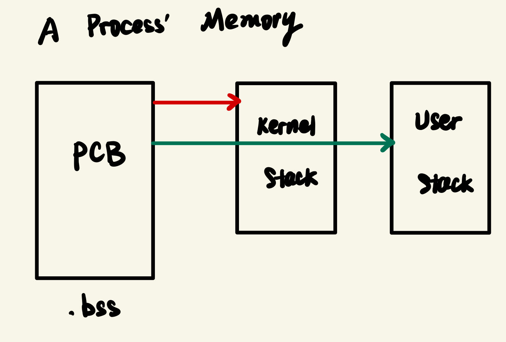
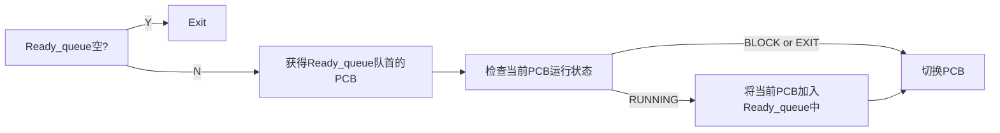

# Project2-SimpleKernel
## Part 1
本部分主要任务是实现进程的初始化和挂载运行，实现基于跳转表的系统调用，并且实现锁的基本操作。

### Task 1：任务启动与非抢占式调度
由于本部分尚不涉及中断操作，CPU上的调度需要通过程序自己调用yield系统调用以主动让出CPU资源。
#### 1. PCB
PCB结构如下：  
```C
typedef struct pcb
{
    /* register context */
    // NOTE: this order must be preserved, which is defined in regs.h!!
    reg_t kernel_sp;
    reg_t user_sp;

    /* previous, next pointer */
    list_node_t list;

    /* process id */
    pid_t pid;

    /* BLOCK | READY | RUNNING */
    task_status_t status;

    /* cursor position */
    int cursor_x;
    int cursor_y;

    /* time(seconds) to wake up sleeping PCB */
    uint64_t wakeup_time;

    /* name */
    char name[MAX_NAME_LEN];
} pcb_t;
```
与default相比增加了name一项，用于记录进程名称。此外，在PCB中嵌入了list链表项，笔者实现了以下操作：  
```C
// void list_insert(head_ptr, node_ptr): insert node into head
static inline void list_insert(list_node_t *list_head_ptr, list_node_t *list_node_ptr)

// delete *ptr node
static inline void list_delete(list_node_t *ptr)

// list_node_t *list_delete(head_ptr): pop node from head
static inline list_node_t *list_pop(list_node_t *list_head_ptr)
```
需要注意的是以上操作均是针对PCB中的链表项进行的，要对相应的PCB操作还需要根据list项在PCB中的位置进行恢复。  

#### 2. 初始化
一个进程所占用的内存区域如下：  
<center></center>  
因此，在初始化PCB时，需要在内核栈和用户栈上为其分配空间。  
此外，内核第一次将进程挂载到CPU上时，需要为其准备一个假现场，即伪造相应的寄存器值，使得switch_to函数可以正常运行。其中最需要注意的是ra寄存器，在Part-1中只需令其为对应task的entry_point即可。  

#### 3. switch_to
该函数功能是完成**内核态**上的上下文的切换。其过程为：  
`在当前进程的内核栈上保存相应寄存器` - `切换到下一进程的内核栈` - `恢复相应寄存器值` - `跳转到ra地址恢复运行`  
需要注意的是线程寄存器tp也需要改变。  

#### 4. 调度
调度流程如下：


#### 5. 其他
在Part-1中，事实上所有的用户进程都是运行在内核栈上的，在Part-2加入中断后将进一步实现内核-用户的分离。

### Task 2：互斥锁的实现
本部分主要任务是调用相应的原子操作API实现互斥锁的初始化、请求和释放。

#### 1. 锁结构
锁的结构如下：
```C
typedef struct mutex_lock
{
    spin_lock_t lock;
    list_head block_queue;
    int key;
} mutex_lock_t;
```
其中，lock项为锁本身，其有两种状态：lock和unlock；block_queue为请求该锁的进程的队列；key为该锁对应的句柄。  

#### 2. 锁相关操作（lock.c）
```C
int do_mutex_lock_init(int key);
void do_mutex_lock_acquire(int mlock_idx);
void do_mutex_lock_release(int mlock_idx);
```
`do_mutex_lock_init`：创建一个句柄为key的锁，返回该锁的id。  
`do_mutex_lock_acquire`：尝试获取句柄为mlock_idx的锁，若失败则将当前进程挂起到对应锁的block_queue中。  
`do_mutex_lock_release`：释放句柄为mlock_idx的锁，之后会从锁的block_queue中获得一个进程并将其加入ready_queue中；若block_queue中已无进程，则将锁的状态置为unlock。  
