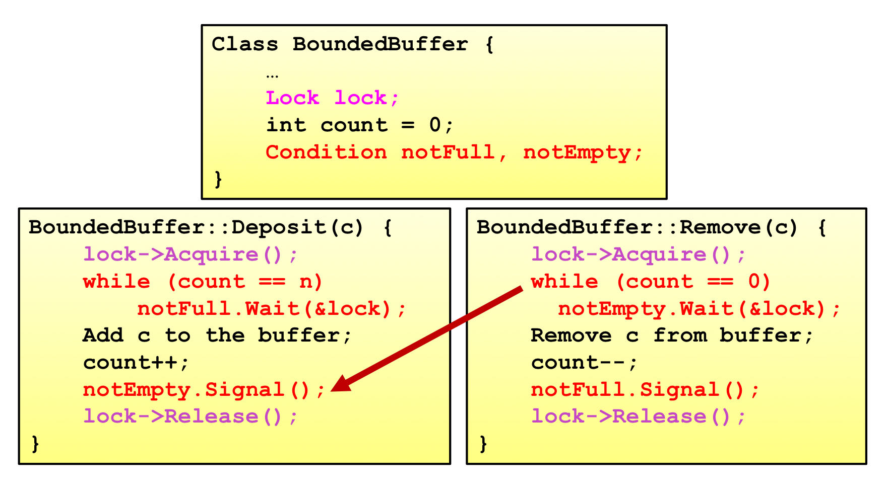

# Project3-InteractiveOS_and_ProcessManagement
笔者实现了除了细粒度锁之外的全部内容。
## Task 1
本任务主要目标是实现一个简单的终端，支持用户命令的读取、解析和显示，并且能根据用户输入进行相应的系统调用。  
笔者首先封装了三个简易的函数：  
```C
/* [p3] small tools :D */
int my_getchar(){
    int ch = sys_getchar();
    while (ch == -1)    ch = sys_getchar();
    return ch;
}

void my_putchar(int ch){
    char tmp_buff[2] = {ch, '\0'};
    sys_write(tmp_buff);
    sys_reflush();
}

void backspace(){
    sys_move_cursor_c(-1, 0);
    sys_write(" ");
    sys_move_cursor_c(-1, 0);
    sys_reflush();
}
```  
用户键入的命令会被暂存到数组buffer中，当终端检测到用户输入了换行('\r')，会根据buffer中的内容去进行相应的系统调用。目前笔者的shell并不支持命令回滚、滚屏、控制光标移动等功能。  

Task 1中需要实现内核中对应的exec, kill, exit和waitpid的系统调用。此外，TASK 1中还需要实现progress_show, getpid等系统调用，较为简单不赘述。  
### exec
exec在内核中对应的方法是cmd.c中的do_exec()函数。在实现exec时，笔者对原有的init_pcb方法进行了改进，支持通过任务名创建一个pcb，同时支持argc和argv的参数传递。  
```C
// In task.c
pid_t init_pcb_vname(char *name, int argc, char *argv[]);
```
本实验后笔者已支持pcb的复用，支持将状态为UNUSED（未使用）或者EXITED（已退出）的pcb重新分配给新的进程，但是目前pid号是不复用的。初次分配pcb时（状态为UNUSED），需要进行用户栈和内核栈的分配，将其记录在user_stack_base和kernel_stack_base中，之后再次分配只需将用户栈和内核栈指针恢复到这两个位置即可。  
同时，在初始化进程的栈时，需要将argc和argv写到对应的寄存器上下文的位置，并且在用户栈上分配对应空间并拷贝argv[]中的字符串内容。  

### kill
kill在内核中对应的方法是sched.c中的do_kill()。进行kill操作时，需要释放当前进程占有的锁资源，笔者的方法是在锁中加入对持有者pid的记录，kill时扫描寻找与当前pid匹配的锁并释放。上述方法显然不是最优的，当锁资源数量庞大时，这样的扫描的时间开销是不能接受的。一个可能的解决方案是在pcb中以链表的方式记录已经占有的锁，释放的时候只需扫描这个链表即可（没实现，口嗨罢了 :) ）。  
除了锁的释放，kill时还需要将pcb从各种队列中剥离。然而考虑到pcb所在的位置是确定的，即pcb至多出现在一个队列中，因此这只是一个简单的删除链表节点的操作。  
此外记得将wait_queue中阻塞的进程释放到准备队列。  

### exit
自杀（`do_kill(current_running->pid)`）。需要注意的是，在用户进程结束时需要执行sys_exit()释放相应资源：  
```
    # in crt0.S
    ...
    /* TODO: [p1-task3] enter main function */
    jal     main

    /************************************************************/
    /* TODO: [P3] call sys_exit */
    jal     sys_exit
    /************************************************************/
    ...
```

### waitpid
将当前的pcb阻塞到对应进程的wait_queue中即可。  

## Task 2
本任务主要目标是实现屏障和信号量的同步原语和mailbox实现的IPC。除此之外，笔者还实现了条件变量的同步原语。  
需要注意的是，在kill进程时并不会进行屏障的回收，这意味着被阻塞在屏障的其他进程可能永远都不会被释放，当然我们认为让这些进程重见天日应当时使用者的工作。:D  
### Semaphore
实现的方法在sema.c中，包括：  
* 信号量的初始化（`init_semaphores()`）  
* 信号量的分配（`do_semaphore_init()`）  
* 信号量增（`do_semaphore_up()`）  
* 信号量减（`do_semaphore_down()`）  
* 信号量的回收（`do_semaphore_destroy()`）  


### Barrier
实现的方法在barrier.c中，包括：  
* 屏障初始化（`init_barriers()`）  
* 屏障分配（`do_barrier_init()`）  
* 将进程阻塞在屏障（`do_barrier_wait()`）  
* 屏障回收（`do_barrier_destroy()`）  

### Mailbox
笔者的mailbox通信是基于条件变量用类似管程的方法实现的。其实就是一个典型的生产者-消费者模型，放一张理论课slice，对应方法在mailbox.c中，也不再赘述 :grin:  
  

## Condition Variable
实现的方法在cond.c中，支持信号量的初始化、sigal、wait、broadcast以及destroy，支持通过句柄使用条件变量，同时也支持通过指向条件变量的指针直接使用条件变量。  

## Task 3
本任务的目标是支持多核启动和运行。讲义在此部分叙述也足够清晰了，因此笔者在此仅叙述实现时个人认为的重点：  
### 大内核锁 
处理器核何时进入内核态？——时钟中断，因此在保存完寄存器上下文之后选择进行lock_kernel()的操作。  
处理器核何时离开内核态？——中断返回，因此在恢复寄存器上下文寄存器之前选择进行unlock_kernel()的操作。  

### 核间中断
需要注意主核是可以给自己发核间中断的（请务必设置好mask参数）。 :sob:  

### 调度
在调度方便，两个核共用一个ready_queue，且有两个current_running保存两个核的当前运行进程。  
需要注意的是，有可能出现当前进程池中只有一个甚至没有进程可用的情况，在这种情况下笔者的解决方法是允许调度pid0_core0_pcb和pid0_core1_pcb这两个伪进程，当然这两个进程是不会出现在ready_queue里的。  
此外，请务必注意这两个伪进程的栈空间分配。  

## Task 4
本任务的目标是支持进程的绑核操作。  
绑核在内核中的方法为cmd.c中的`do_taskset()`。在进程调度时，需要根据进程的绑核情况和当前的处理器核选择合适的进程。  
需要注意的是，此时就不是简单的从ready_queue中取一个进程就结束了，因为可能出现ready_queue中的进程均不能在当前处理器核上运行的情况。:smiley:  

## 运行流程
多核启动
```bash
    make clean
    make
    make run-smp
```
在bbl中使用`loadbootm`启动双核。  
